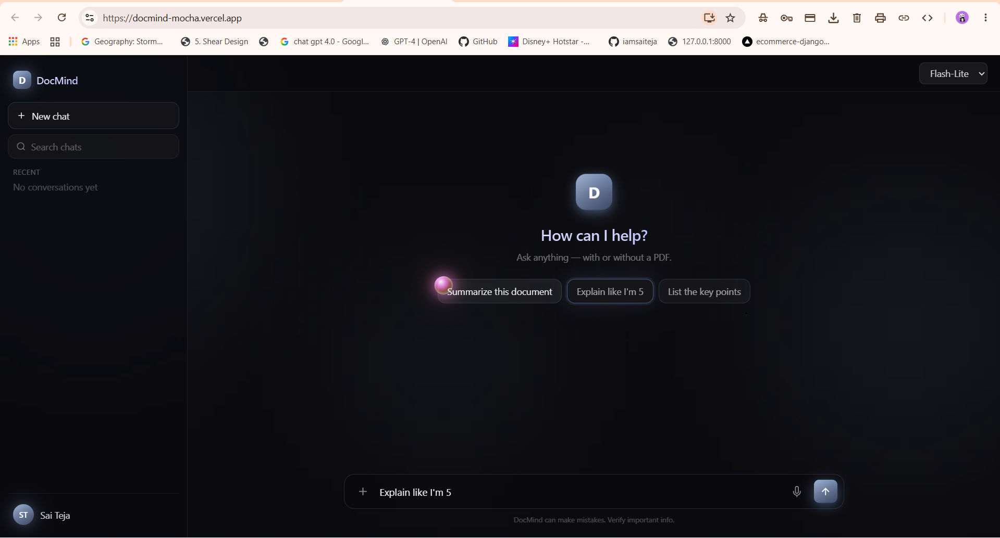

# DocMind 🧠

## 📸 Screenshots

### Home Page



> An AI-powered document assistant built with RAG (Retrieval-Augmented Generation). Upload PDFs, ask questions, get answers grounded in your documents with source citations.

**🔗 Live Demo:** [](https://docmind-mocha.vercel.app)
# 🧠 DocMind

AI-powered document assistant built with RAG.

[](https://docmind-mocha.vercel.app)
[](https://github.com/iamsaiteja/docmind)
[]()
[]()
[]()
[]()
[]()


---

## ✨ Features

- 📄 **Multi-PDF Upload** — Upload and query multiple documents simultaneously
- 💬 **Conversational Q&A** — Natural language questions over your documents
- 🔍 **Source Citations** — Every answer is grounded with the exact source chunks
- 🎙️ **Voice Input** — Ask questions via speech recognition
- 🎨 **Model Selection** — Switch between Gemini Flash and Flash-Lite
- 💾 **Chat History** — Conversations persist across sessions (localStorage)
- 🌙 **Modern UI** — Dark theme with liquid-glass animations

---

## 🏗️ Architecture

┌─────────────────┐         ┌──────────────────┐         ┌───────────────┐

│   React (UI)    │ ──────► │   FastAPI (API)  │ ──────► │  Google Gemini│

│   Vercel        │         │   Render         │         │  (LLM + Embed)│

└─────────────────┘         └────────┬─────────┘         └───────────────┘

│

▼

┌──────────────────┐

│   ChromaDB       │

│   (Vector Store) │

└──────────────────┘

**Flow:**
1. User uploads PDF → text extracted via `pypdf`
2. Text chunked using LangChain's `RecursiveCharacterTextSplitter`
3. Chunks embedded using Gemini embeddings → stored in ChromaDB
4. On question: semantic search retrieves top-3 chunks
5. LLM generates answer grounded in retrieved context with source attribution

---

## 🛠️ Tech Stack

### Backend
- **FastAPI** — Async Python web framework
- **LangChain** — Document loaders, text splitters
- **ChromaDB** — Persistent vector database
- **Google Gemini API** — Embeddings + LLM (Flash / Flash-Lite)
- **pypdf** — PDF text extraction

### Frontend
- **React 19** — UI framework
- **Tailwind CSS** — Styling
- **Framer Motion** — Animations
- **Axios** — HTTP client
- **Web Speech API** — Voice input

### DevOps
- **Vercel** — Frontend hosting (auto-deploy on push)
- **Render** — Backend hosting
- **GitHub Actions** — CI/CD

---

## 🚀 Local Setup

### Prerequisites
- Python 3.10+
- Node.js 18+
- Google Gemini API key ([get one here](https://aistudio.google.com/apikey))

### Backend
```bash
cd backend
python -m venv venv
venv\Scripts\activate     # Windows
pip install -r requirements.txt

# Create .env file
echo GEMINI_API_KEY=your_key_here > .env

uvicorn main:app --reload
```

Backend runs on '(https://docmind-12ms.onrender.com/)'.

### Frontend
```bash
cd frontend
npm install
npm start
```

Frontend runs on `(https://docmind-mocha.vercel.app/)`.

---

## 📡 API Endpoints

| Method | Endpoint | Description |
|--------|----------|-------------|
| `GET`  | `/` | Health check |
| `POST` | `/upload-pdf` | Upload PDF(s), extract + embed + store |
| `POST` | `/ask` | Query the document store with a question |

**Example request:**
```bash
curl -X POST https://docmind-12ms.onrender.com/ask \
  -H "Content-Type: application/json" \
  -d '{"question": "Summarize the document", "model": "gemini-2.5-flash-lite"}'
```

---

## 🗺️ Roadmap

- [ ] JWT authentication + per-user data isolation
- [ ] Streaming responses (Server-Sent Events)
- [ ] Page-level citations with PDF highlighting
- [ ] Background async indexing for large PDFs (Celery + Redis)
- [ ] Migrate to Pinecone for production-grade vector search
- [ ] Mobile-responsive UI
- [ ] OCR support for scanned PDFs
- [ ] Document comparison across PDFs

---

## 📂 Project Structure

docmind/

├── backend/

│   ├── main.py              # FastAPI app + RAG pipeline

│   ├── requirements.txt

│   ├── chroma_db/           # ChromaDB persistence

│   └── uploads/             # Uploaded PDFs

├── frontend/

│   ├── src/

│   │   ├── App.js           # Main React component

│   │   ├── components/

│   │   │   └── MouseOrb.jsx # Iridescent cursor

│   │   └── index.css        # Tailwind + custom CSS

│   ├── tailwind.config.js

│   └── package.json

└── README.md

---

## 👨‍💻 Author

**Sai Teja Golla**
- 💼 LinkedIn: [@golla-saiteja](https://www.linkedin.com/in/golla-saiteja)
- 🐙 GitHub: [@iamsaiteja](https://github.com/iamsaiteja)
- 📧 tejayadav872@gmail.com

---

## 📜 License

MIT License — feel free to learn from this and build your own version.

---

⭐ If you found this useful, give it a star!

